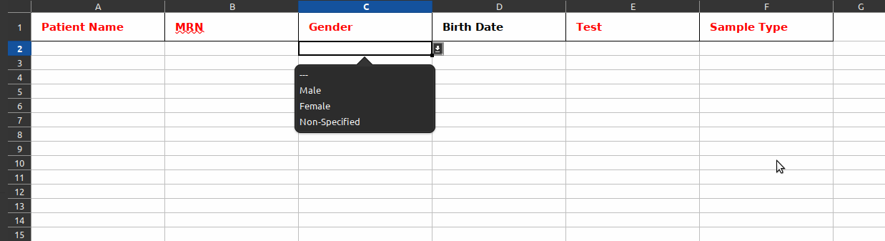

## django-batch-sheet

Most of the projects we worked on needs a feature to upload data in batch, we always ended up writing another code to handle 
the Excel sheet and where each column shall go in the model(s), in the latest project we decided to handle it differently
and that is why we wrote a django app that handles this like ModelForm handles models and surprisingly, it worked.

## Features
* Generate a Sheet from a Django model or a combination of models (through Combined Sheet),
* Add the validation rules for Choices, Foreign Keys, Integers automatically in Excel,
* Showing the required field in red by default
* Sheet can be validated automatically and check with `is_valid()`
* Allow  overriding the behavior of  model in the class,
* Allow alot of functions to override the class behavior (`row_preprocess`,`save`,`pre_load`,`post_process`),
* Automatic Loading of the data in the sheet to the model.

## Install
1. Install the package
```sh
pip install django-batch-sheet
```
2. Add it to INSTALLED_APPS
```python
INSTALLED_APPS=[
...
'batch_sheet'
...
]
```

## Example

Let's assume that we have the following models with these rules

* Patient can have multiple tests but saved once as a `Patient` Object.

```python
class Test(models.Model):
    name = models.CharField(max_length=50)

    def __str__(self):
        return self.name


class Gender (models.Model):
    name = models.CharField(max_length=50)

    def __str__(self):
        return self.name

class Patient(models.Model):
    name = models.CharField(max_length=50,verbose_name="Patient Name")
    MRN = models.CharField(max_length=50)
    gender= models.ForeignKey(Gender,on_delete=models.PROTECT,null=True, verbose_name="Gender")
    date_of_birth = models.DateField(null=True,blank=True,verbose_name="Birth Date")
    date_admitted = models.DateField(auto_now_add=True,auto_created=True)
    lastUpdate = models.DateTimeField(auto_now=True)


class RequestedTest(models.Model):
    patient = models.ForeignKey(Patient,on_delete=models.CASCADE)
    test = models.ForeignKey(Test,on_delete=models.PROTECT,verbose_name="Test")
    sample_date = models.DateField(auto_now_add=True,auto_created=True)
    sample_type = models.CharField(max_length=50, verbose_name="Sample Type",choices=(('Blood','Blood'),('DNA','DNA')))
    lastUpdate = models.DateTimeField(auto_now_add=True)
```

We want to combine both Models in on sheet, so we put the patient information with the requested test in one row.

So For Patient, we will implement the class `PatientSheet` as follows

```python
class PatientSheet(Sheet):
    def save(self, obj:Patient, row_objs:dict):
        """Lets handle the save manually to check if the MRN exists"""
        patient = Patient.objects.filter(MRN = obj.MRN)
        if patient.exists():
            p = patient[0]
        else:
            p = obj
            p.save()
        return p
    class Meta:
        exclude=('id','date_admitted','lastUpdate')
        Model = Patient
        obj_name = "patient"
        title_header = True
```
For the Meta attributes, please go to the Meta Attributes sections

For RequestedTest Sheet, it goes like this 

```python
class RequestedTestSheet(Sheet):
    def save(self,obj,row_objs):
        patient = row_objs.get('patient')
        if patient is None:
            return None
        else:
            obj.patient = patient
            obj.save()
            return obj

    class Meta:
        exclude =('id','sample_date','lastUpdate')
        validation_exclude = ('patient',)
        title_header = True
        Model = RequestedTest
```

Now Lets combine them in one sheet

```python
class TestSheet(CombinedSheet):
    patient = PatientSheet()
    test = RequestedTestSheet()
```

Now Let's Generate The sheet

```
$ python manage.py generate_sheet --xls App.xls --sheet test_app.sheets.TestSheet
```
This will the file to `App.xls` in the folder, now, lets open `App.xls`



We got the dropdown automatically, based on the value in the database.

## Meta Options
```python
    Class Meta:
        rows_count = 10              # Number of rows to apply validations on
        columns = ()                 # Columns to add from the Model to the sheet
        exclude = ()                 # Columns to exclude
        Model = None                 # Model to scan
        raw_cols = []                # Foreign Key Field that shouldn't be set as dropdown
        title_header = False         # Make the titles as "First Name"
        validation_exclude=[]        # Don't validate these field, important in case of objects relationship  
        object_name = None           # The name of the object saved, important in case of Combined Sheet.
            

```
